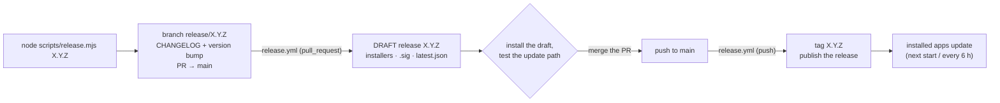

# Contributing to Bebok

Short version of how work lands in this repository. The contributor/agent
orientation guide is [AGENTS.md](AGENTS.md); the CI/release internals are in
[scripts/release.md](scripts/release.md).

## Day-to-day

- Work on a branch, one git worktree per work package; merges to the default
  branch go through a pull request.
- Before pushing: `cd engine && cargo fmt --check && cargo clippy --workspace --all-targets -- -D warnings && cargo test --workspace`
  and `cd client && npm run build && npm test`.
- i18n keys are added to **all 12** dictionaries in `client/src/i18n/`
  (`en.ts` is the reference; a missing key elsewhere is a compile error).
- No `Co-Authored-By` trailers in commit messages.
- Keep `CHANGELOG.md` current: add your change under `## Unreleased` in the
  same PR. The release process turns that section into `## X.Y.Z — date`.

## Releasing

A release is **only** ever produced by `.github/workflows/release.yml`.
Installed desktop apps update themselves from what that workflow publishes
(`latest.json` + signed bundles), so a hand-made release is not just untidy -
it silently breaks auto-update for everyone. Never upload, replace or delete
release assets by hand.

The process is one command, one PR, one merge:



### 1. Start: `node scripts/release.mjs X.Y.Z`

Works on Linux, macOS and Windows (Node >= 20, `git`, `gh` logged in). It:

- checks a clean tree, switches to `main`, fast-forwards to `origin/main`
  and looks at the last CI run;
- takes the version (or suggests the next patch/minor/major) and refuses one
  that is already tagged;
- shows the `## Unreleased` section of `CHANGELOG.md` and renames it to
  `## X.Y.Z — YYYY-MM-DD` (these notes become the update notes users see
  in the app - write them before you start);
- runs `npm run version:bump -- X.Y.Z` (all seven manifests/lockfiles);
- commits `chore: release X.Y.Z` on `release/X.Y.Z`, pushes and opens the
  PR (`--no-pr` prints the command instead, `--yes` skips the questions).

Nothing is released yet.

### 2. Test: the PR builds a draft

Every push to a `release/**` PR runs the full pipeline and creates (or
refreshes) a **draft** GitHub Release named `X.Y.Z` - installers for all
four platforms, their `.sig` files, `SHA256SUMS.txt` and `latest.json`.
Drafts are invisible to users and never *Latest*, so installed apps ignore
them. Download the draft from the Releases page, install it on a machine
that runs the previous version and check the update path (topbar version
chip -> Updates -> *Check for updates*). `node scripts/release.mjs status`
shows the PR, the run, the draft and the live feed at any time.

### 3. Ship: merge the PR

Merging pushes the bumped version to `main`. The workflow sees a version
without a tag, rebuilds it from the merge commit, tags it `X.Y.Z` and
publishes the release (the draft is promoted, `draft: false`). Within 10 s
of their next start - or at their next 6-hourly check - installed apps offer
*Install & restart*.

Verify afterwards:

```bash
node scripts/release.mjs status X.Y.Z      # PR merged · tag exists · release published · latest.json → X.Y.Z
```

Any other push to `main` (a normal feature merge) stops in `preflight` in a
few seconds: its version is already tagged, nothing to release.

### If something fails

- **CI red on the release PR** - fix on the same `release/X.Y.Z` branch and
  push; the draft is rebuilt. If the fix needs code on `main`, merge that
  first and rebase the release branch.
- **`preflight` says the version is already released** - someone tagged that
  version already; run `cd client && npm run version:bump -- <next>` on the
  release branch and push.
- **A build leg failed** (runner hiccup) - re-run the failed jobs from the
  Actions UI; the `release` job waits for all four.
- **`release` failed at "Compose latest.json"** - a signed bundle is missing;
  check that `TAURI_SIGNING_PRIVATE_KEY` is set (Settings -> Secrets and
  variables -> Actions). The updater key is mandatory.
- **The merge published nothing** - the pushed version was already tagged
  (see the preflight log). Do **not** create the release by hand from local
  builds: that is how `1.6.1` ended up as *Latest* with `1.6.0` binaries and
  no manifest. Bump to the next patch and go through the PR again.

### Manual and test paths

- Tagging by hand still works: `git tag X.Y.Z && git push origin X.Y.Z` on a
  commit whose manifests already say `X.Y.Z` publishes exactly like a merge.
- Pipeline dry run without a PR: bump on any branch, then
  `gh workflow run release.yml --ref <branch> -f draft=true`; delete the
  draft (`gh release delete X.Y.Z --yes`) afterwards.
- Version suffixes must be **numeric** (`X.Y.Z-1`): the MSI bundler rejects
  `-rc.1` / `-beta.1`, so `preflight` rejects them too. A suffixed tag is
  published as a *pre-release* - not *Latest*, never offered to installed
  apps.

### Keys and secrets

`TAURI_SIGNING_PRIVATE_KEY` (+ optional `_PASSWORD`) signs every bundle;
installed apps verify against `plugins.updater.pubkey` in
`client/src-tauri/tauri.conf.json`. The private key lives outside the repo -
keep a backup in a password manager. Losing it means installed copies can
never auto-update again. Details, rotation and the optional Authenticode/GPG
signing: [scripts/release.md](scripts/release.md).
