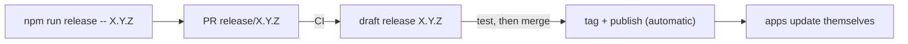

# Contributing to Bebok

Polish version: [CONTRIBUTING.pl.md](CONTRIBUTING.pl.md). Orientation for
contributors and agents: [AGENTS.md](AGENTS.md).

## Rules

- Branch + pull request into `main`; one git worktree per work package.
- Before pushing: `cd engine && cargo fmt --check && cargo clippy --workspace --all-targets -- -D warnings && cargo test --workspace`,
  then `cd client && npm run build && npm test`.
- New i18n keys go into **all 12** dictionaries in `client/src/i18n/` (`en.ts` is the reference).
- No `Co-Authored-By` trailers.
- Describe your change under `## Unreleased` in `CHANGELOG.md` in the same PR.

## Releasing

0. **`npm run release:check`** - read-only readiness list (tree, CI, changelog,
   signing secret, open release PR). `release` runs it first anyway.
1. **`npm run release -- X.Y.Z`** - checks the tree and CI, turns
   `## Unreleased` into `## X.Y.Z — date`, bumps the version everywhere,
   opens the PR `release/X.Y.Z`. Write the changelog first: it becomes the
   update notes users see in the app.
2. **Test the draft** - CI builds a draft release from the PR (all
   platforms, signed, `latest.json`). Drafts are invisible to users. Install
   it over the previous version and check *Check for updates* in the app.
3. **Merge** - CI tags `X.Y.Z` and publishes. Installed apps update at their
   next start or within 6 h. Check with `npm run release:status`.

Never upload or edit release assets by hand - installed apps trust only what
CI publishes. If a run fails, fix and push on the same `release/X.Y.Z`
branch; a missing `.sig` means `TAURI_SIGNING_PRIVATE_KEY` is not set.
Pre-release versions must be numeric (`X.Y.Z-1`, MSI rejects `-rc.1`).

CI internals, secrets and signing: [scripts/release.md](scripts/release.md).
