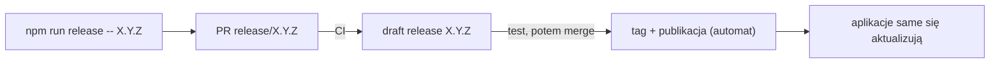

# Jak kontrybuować do Beboka

Wersja angielska: [CONTRIBUTING.md](CONTRIBUTING.md). Przewodnik dla
kontrybutorów i agentów: [AGENTS.md](AGENTS.md).

## Zasady

- Branch + pull request do `main`; jeden git worktree na paczkę pracy.
- Przed pushem: `cd engine && cargo fmt --check && cargo clippy --workspace --all-targets -- -D warnings && cargo test --workspace`,
  potem `cd client && npm run build && npm test`.
- Nowe klucze i18n trafiają do **wszystkich 12** słowników w `client/src/i18n/` (`en.ts` jest wzorcem).
- Bez trailerów `Co-Authored-By`.
- Prefiksy commitów: `feat:`, `fix:`, `docs:`, `chore:` (`feat!:` dla zmian łamiących) -
  skrypt releasu wyprowadza z nich wersję i szkic changelogu.
- Opisz zmianę pod `## Unreleased` w `CHANGELOG.md` w tym samym PR-ze.

## Wydawanie wersji

0. **`npm run release:check`** - lista gotowości, nic nie zmienia (drzewo, CI,
   changelog, sekret podpisu, otwarty release-PR). `release` i tak zaczyna od niej.
1. **`npm run release`** (wersja opcjonalna) - sprawdza drzewo i CI,
   proponuje wersję na podstawie commitów od ostatniego taga (`feat!` /
   `BREAKING CHANGE` -> major, `feat` -> minor, reszta -> patch), zamienia
   `## Unreleased` na `## X.Y.Z — data` - a gdy sekcja jest pusta, układa ją
   z commitów - podbija wersję w manifestach i otwiera PR `release/X.Y.Z`.
   Changelog to notatki, które użytkownik zobaczy w aplikacji, więc używaj
   prefiksów `feat:` / `fix:` w commitach i przejrzyj szkic.
2. **Przetestuj draft** - CI buduje z PR-a draft release (wszystkie
   platformy, podpisane, `latest.json`). Drafty są niewidoczne dla
   użytkowników. Zainstaluj go na poprzedniej wersji i sprawdź
   *Check for updates* w aplikacji.
3. **Merge** - CI taguje `X.Y.Z` i publikuje. Zainstalowane aplikacje
   aktualizują się przy następnym uruchomieniu lub w ciągu 6 h. Sprawdź
   przez `npm run release:status`.

Nigdy nie wgrywaj ani nie edytuj plików release'u ręcznie - zainstalowane
aplikacje ufają tylko temu, co opublikuje CI. Jeśli run padnie, popraw i
wypchnij na tym samym branchu `release/X.Y.Z`; brak `.sig` oznacza brak
sekretu `TAURI_SIGNING_PRIVATE_KEY`. Wersje pre-release muszą mieć sufiks
liczbowy (`X.Y.Z-1`, MSI odrzuca `-rc.1`).

Mechanika CI, sekrety i podpisywanie: [scripts/release.md](scripts/release.md).
