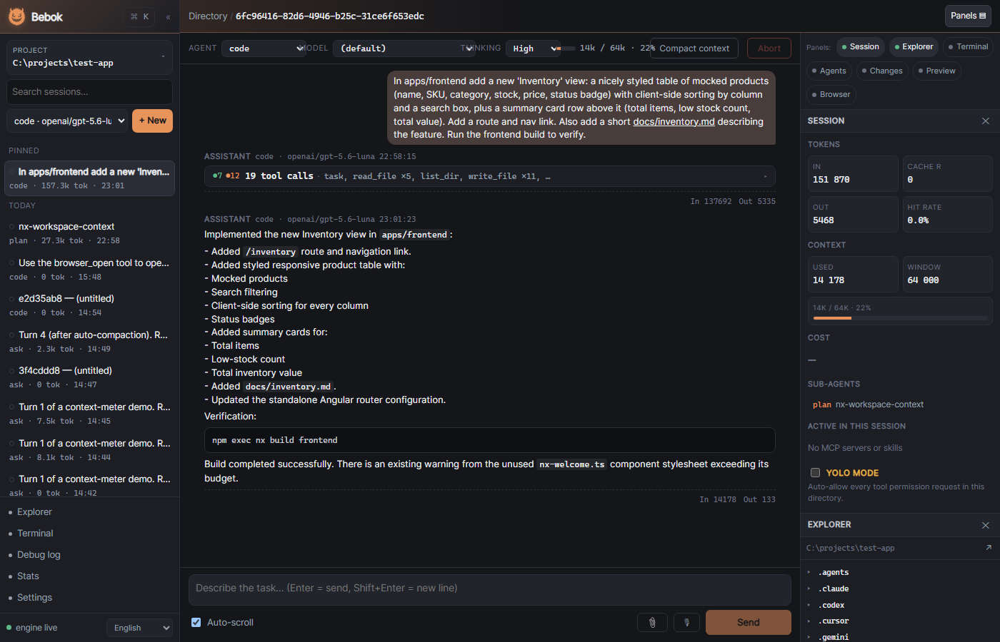
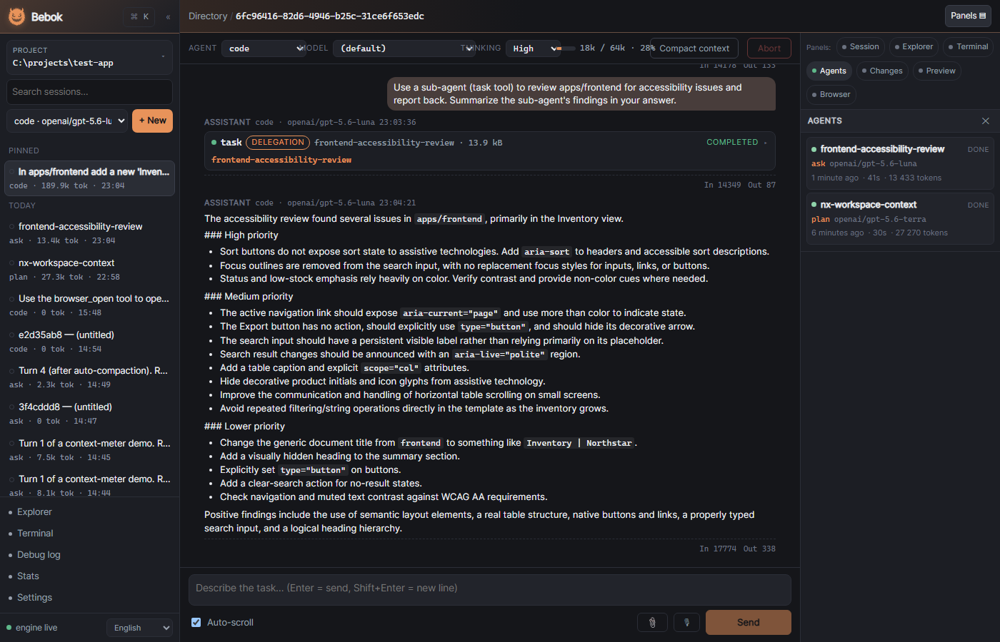
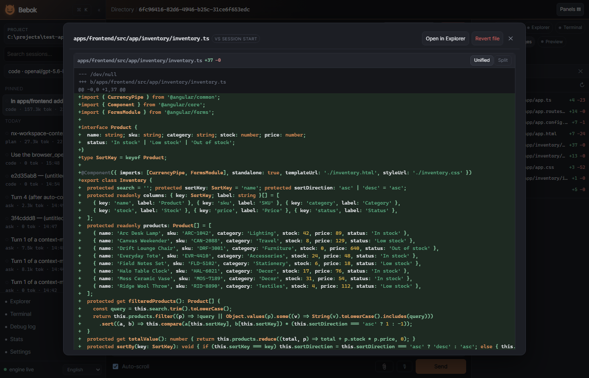
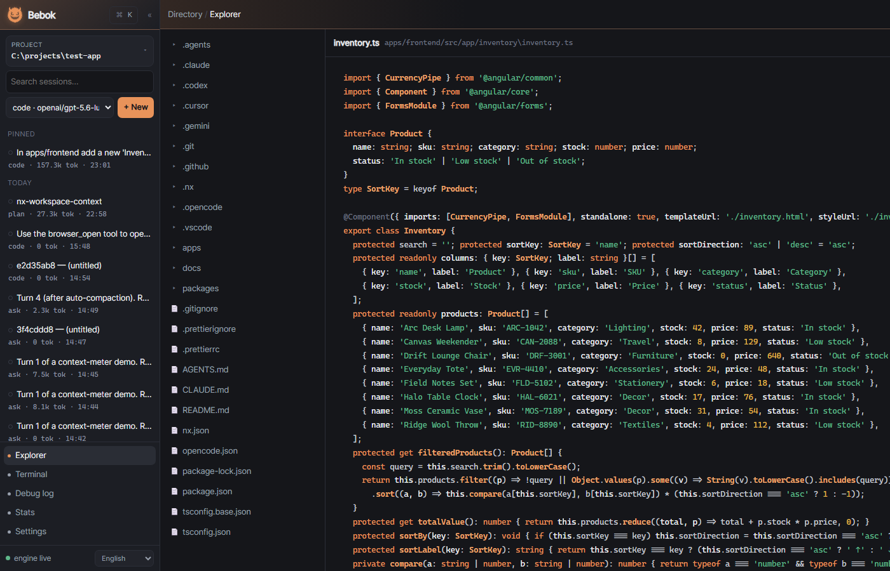

# Bebok 1.5.0

Bebok is a local-first AI coding agent. A headless Rust engine (axum + tokio,
HTTP + SSE + WebSocket) owns sessions, tools, permissions, sub-agents and
configuration; a thin Angular client renders it. The client runs as a desktop
app (Tauri 2, engine bundled as a sidecar) or in the browser against an engine
you start yourself. Everything runs on your machine; the only network traffic
is to the LLM providers you configure.

Roadmap: 1.6.0 adds an Android app (chat + remote follow).










## Features

### Chat
- Every tool call collapses into a one-line row; consecutive tool-only turns merge
  into one group with summed In/Out usage (group -> call -> arguments/output expand).
- Safety-level dots on each tool call (`safe` / `caution` / `dangerous` /
  `uncategorized`) with a legend.
- Context meter (tokens sent vs. the model window from the catalog), "Compact
  context" button, automatic compaction at 85 % with a server-side marker.
- Typed inline chips for paths, commands and identifiers; file paths and `.md`
  links open the Preview panel; bare URLs are clickable.
- Syntax highlighting (highlight.js, lazy per language) shared by chat, Preview,
  Explorer and the diff view; ATX headings; model text is HTML-escaped.
- Long transcripts render the last 60 messages with "Load earlier messages".
- Image attachments (png/jpeg/webp/gif, 5 per prompt, 5 MiB each) for vision models.
- Thinking effort per session (`off` / `low` / `medium` / `high` / `max`).

### Panels (right drawer, 320 px, multi-select)
- **Session** - tokens, cache hit rate, cost, sub-agents, active MCP servers and
  skills, YOLO toggle.
- **Explorer** - gitignore-aware lazy tree with viewer/editor served by the engine.
- **Terminal** - engine-owned PTYs (xterm.js, 1 MiB scrollback, survive GUI
  restarts) plus **Processes**: background `bash` jobs with log tailing and kill.
- **Agents** - live sub-agent list with a read-only streaming transcript overlay.
- **Changes** - files modified by tools, unified/split diff against git HEAD or a
  first-write snapshot, "Open in Explorer", confirmed revert (sub-agent sessions included).
- **Preview** - Markdown renderer with file picker, pin and modified-on-disk notice.
- **Browser** - latest screenshot and URL from the browser tools, "Open in window".

### Agents & verification
- Presets `code`, `ask`, `plan`, `debug`, `orchestrator` plus your own
  `<config dir>/bebok/agent/*.md` and `<project>/.bebok/agent/*.md` (hot reload).
- Delegation with supervision: `delegation.mode` `off` | `auto` | `always`,
  `max_concurrent`, `model_policy` `inherit` | `cheaper` (default; catalog-based
  cheaper sibling) | explicit model; background tasks via `task`, `task_status`,
  `task_wait`, `task_cancel`; token-free progress rows in the parent transcript.
- Autonomous frontend verification (`verify.frontend`): the sub-agent starts every
  dependency on its own non-default port, waits for readiness, screenshots the
  loaded page, checks the API, fixes and re-verifies, and must report
  `Status: PASS` / `PASS WITH NOTES` / `FAIL` - the parent treats it as a gate.
- `browser_open` / `screenshot` / `click` / `type` / `get_text` / `eval` /
  `console` / `wait` / `find` drive an installed Chrome, Edge or Chromium through
  CDP (`chromiumoxide`). Display modes: `headed` (default), `viewer` (a second
  window with a live frame stream), `drawer`. Screenshots reach the model as images.
- `bash` supports `background: true` with readiness waits (`ready_port` /
  `ready_text` / `ready_timeout`) and `bash_kill`.

### Projects & git
- Project registry with groups and a grouped, collapsible switcher.
- Git awareness per project (branch, remote, GitHub, dirty count).
- Worktree sessions: "Run in a git worktree" creates a branch under
  `<project>/.bebok/worktrees/` (gitignored by the engine); branch badge in the
  sidebar; worktree removal offered when the session is deleted.

### Providers & models
- Catalog-driven provider settings ("Test connection", model list, per-provider
  env var hint), vendored [models.dev](https://models.dev) snapshot for context
  windows, pricing and cheaper-sibling mapping.
- Streaming with retry/backoff and vendor-neutral error mapping (rate limits,
  `retry_after`), prompt-cache accounting, cost per session.
- Reasoning effort mapped per provider (`reasoning_effort` for OpenAI-compatible,
  `budget_tokens` for Anthropic / Z.ai).

### Security
- Per-launch capability token: the engine prints `BEBOK_READY http://127.0.0.1:<port>/?token=...`;
  every request needs `Authorization: Bearer` or `?token=`; a rejected token shows a
  reconnect prompt in the client.
- Path guards confine file tools and the Explorer to the project root; the engine
  binds `127.0.0.1` and restricts CORS to known origins.
- Secrets are redacted in `GET /config` and the diagnostic log; the `token=` query
  is scrubbed from access logs.
- Explicit tool safety categories (`GET /tools/safety`, overridable per tool in
  config) and permission rules (`globset` patterns over `tool(args)`, verdicts
  `allow` / `deny` / `ask`, global + project layers, "Always allow this tool").
- `browser_*` tools default to Ask even when read-only; MCP tools join the same
  gate as `mcp__<server>__<tool>`.

### Also
- **Stats** screen (`GET /stats`): per-project / per-model / per-day usage and cost
  with sortable tables.
- **About** page ("What is Bebok?") with the Silesian legend, in all 12 UI languages.
- MCP bridge (`rmcp`, stdio + streamable HTTP), `AGENTS.md` + `skill/*/SKILL.md`
  prompt assembly, in-process plugin hooks, JSONC config with comment-preserving writers.
- Built-in cross-platform tools: `read_file`, `write_file`, `edit_file`,
  `append_file`, `sed`, `fetch`, `bash` and native ports of `pwd`, `list_dir`,
  `tree`, `stat`, `du`, `head`, `tail`, `wc`, `sort`, `uniq`, `diff`, `which`,
  `glob`, `grep`, `find`, `mkdir`, `touch`, `cp`, `mv`, `rm`, `chmod`, `ln`,
  `gzip`, `realpath`, `basename`, `dirname`, `sha256sum`, `base64`.

## Supported providers

Built into `bebok-llm` (`engine/crates/bebok-llm/src/spec.rs`); the model prefix
selects the provider (`openai/gpt-4.1`, `anthropic/claude-sonnet-4-5`, ...).
The API key comes from the provider entry in config, else `<NAME>_API_KEY`
(e.g. `OPENAI_API_KEY`, `ZAI_API_KEY`), else the top-level `api_key` fallback.

| Name | Kind | Default endpoint |
|---|---|---|
| `openai` | openai | `https://api.openai.com/v1` |
| `anthropic` | anthropic | `https://api.anthropic.com/v1` |
| `zai` | anthropic | `https://api.z.ai/api/anthropic/v1` |
| `xai` | openai | `https://api.x.ai/v1` |
| `deepseek` | openai | `https://api.deepseek.com/v1` |
| `google` | openai | `https://generativelanguage.googleapis.com/v1beta/openai` |
| `mistralai` | openai | `https://api.mistral.ai/v1` |
| `groq` | openai | `https://api.groq.com/openai/v1` |
| `qwen` | openai | `https://dashscope-intl.aliyuncs.com/compatible-mode/v1` |
| `openrouter` | openai | `https://openrouter.ai/api/v1` |
| `ollama` | openai | `http://localhost:11434/v1` (no key) |

Any other OpenAI-compatible or Anthropic-compatible server can be added as a
custom provider (name, kind, endpoint, key) in Settings > Providers.

## Downloads (1.5.0)

Release page: <https://github.com/henrykbrzoska/bebok/releases/tag/1.5.0>
(all assets built by the release workflow from commit `28d673b`; checksums in `SHA256SUMS.txt`).

| OS | Desktop app | Headless engine |
|---|---|---|
| Windows x64 | `bebok_1.5.0_x64-setup.exe` (NSIS), `bebok_1.5.0_x64_en-US.msi`, `bebok-1.5.0-windows-x64-portable.zip` | `bebok-server-1.5.0-windows-x64.exe` |
| Linux x64 | `bebok_1.5.0_amd64.deb`, `bebok_1.5.0_amd64.AppImage`, `bebok-1.5.0-linux-x64-portable.tar.gz` | `bebok-server-1.5.0-linux-x64` |
| macOS Apple silicon | `bebok_1.5.0_aarch64.dmg`, `bebok_1.5.0_aarch64.app.tar.gz` | `bebok-server-1.5.0-macos-arm64` |
| macOS Intel | `bebok_1.5.0_x64.dmg`, `bebok_1.5.0_x64.app.tar.gz` | `bebok-server-1.5.0-macos-x64` |

The builds are **unsigned**. macOS: Gatekeeper blocks the first launch -
right-click > Open, or `xattr -dr com.apple.quarantine /Applications/bebok.app`.
Windows: SmartScreen shows "Windows protected your PC" - More info > Run anyway.
Linux: the AppImage and the portable build need WebKitGTK 4.1 on the host.
Portable archives contain `bebok-desktop` and `bebok-server` side by side; keep
them together (the shell resolves the sidecar next to its own executable). The
standalone `bebok-server` binary is for browser mode / a remote engine.

## Quick start (from source)

Prerequisites: Rust >= 1.88 (edition 2024), Node.js 22 (>= 20 works) + npm,
and for the desktop shell the Tauri 2 system dependencies for your OS
(WebView2 + MSVC build tools on Windows, `webkit2gtk-4.1` / `libsoup-3.0` /
`gtk+-3.0` / `librsvg-2.0` on Linux, Xcode command line tools on macOS - see
[tauri.app](https://tauri.app/start/prerequisites/)). Browser mode needs no Tauri deps.

```bash
npm run doctor                    # rustc/cargo, node/npm, tauri cli, OS-level Tauri deps
npm run full-build-dev -- --open  # engine (debug) + ng serve, browser opens already connected
npm run full-build-app            # engine release + sidecar + Tauri bundles for this OS + SHA256
```

Run these from the repo root (`dev.cmd` / `./dev.sh` are shortcuts for
`full-build-dev`; `dev.cmd tauri` / `./dev.sh tauri` run the desktop shell via
`tauri dev` instead). `full-build-dev` builds `bebok-server`, starts it on
`:8787`, waits for the `BEBOK_READY http://127.0.0.1:8787/?token=...` line on
its stdout, starts `ng serve` on `:4200` and prints
`http://localhost:4200/?engine=<url-encoded BEBOK_READY url>`. The client adopts
the `?engine=` parameter once on first load (engine URL + token, stored like a
manual Connect), strips it from the address bar and then talks to the engine with
`Authorization: Bearer`. Ctrl+C stops both processes.

Flags: `--port`, `--client-port`, `--no-auth` (`BEBOK_NO_AUTH=1`),
`--diagnostic` (`BEBOK_DIAGNOSTIC=1`), `--open`, `--tauri`; `full-build-app`
takes `--bundles nsis,msi|deb,appimage|dmg`, `--skip-engine`, `--skip-tauri`.
`npm run engine` / `npm run client` run one half only. `node scripts/bebok.mjs --help`
lists everything.

Manual equivalent:

```bash
cd engine && cargo run                          # engine on http://127.0.0.1:8787, prints BEBOK_READY
cd client && npm install && npm start           # http://localhost:4200, paste the BEBOK_READY URL
cd engine && cargo build --release && cd ../client && npm run sidecar:copy && npm run tauri:build
```

Engine flags: `--host IP`, `--port PORT` (`0` = random, used by the desktop
shell), `--addr IP:PORT`; explicit flags beat `BEBOK_ADDR`. Logs go to stderr;
stdout is reserved for the `BEBOK_READY` handshake.

## Configuration

Configuration is JSONC (comments preserved on write), layered
defaults -> global -> project (`<project>/.bebok/config.json`, providers merge
by name). The global file lives in the OS config directory (`dirs::config_dir()`):

| OS | Global config | Engine data (sessions, digests) |
|---|---|---|
| Linux | `~/.config/bebok/config.json` | `~/.local/share/bebok/` |
| Windows | `%APPDATA%\bebok\config.json` | `%APPDATA%\bebok\` |
| macOS | `~/Library/Application Support/bebok/config.json` | `~/Library/Application Support/bebok/` |

Custom agents, `AGENTS.md` and `skill/*/SKILL.md` go next to it (`bebok/agent/`,
`bebok/AGENTS.md`, `bebok/skill/`); the diagnostic log `bebok/debug.log` is cleared
on every start and served only with `BEBOK_DIAGNOSTIC=1`. Background process logs
land in `<project>/.bebok/run/<id>.log`.

Environment variables read by the engine:

| Variable | Effect |
|---|---|
| `BEBOK_ADDR` | bind address `IP:PORT` (default `127.0.0.1:8787`; CLI flags win) |
| `BEBOK_NO_AUTH=1` | disable the capability token (local API unauthenticated - logged loudly) |
| `BEBOK_TOKEN` | use this token instead of generating one per launch |
| `BEBOK_CORS` | extra allowed origins, comma separated |
| `BEBOK_DIAGNOSTIC=1` | enable `GET/DELETE /debug/log` (redacted LLM + HTTP trace; 404 otherwise) |
| `BEBOK_SHELL` | shell for `bash` and the terminal (default `cmd /C` on Windows, `sh -c` elsewhere) |
| `BEBOK_BROWSER` | path to the Chrome/Edge/Chromium binary for the `browser_*` tools |
| `BEBOK_BROWSER_HEADLESS=1` | run that browser headless (also `BEBOK_BROWSER_NO_SANDBOX`, `BEBOK_BROWSER_WINDOW_POS`) |
| `BEBOK_MODEL_CATALOG` | path to a models.dev JSON overriding the vendored snapshot |
| `<NAME>_API_KEY` | provider key when the config entry leaves `api_key` empty |

Main sections (all editable in Settings; the GUI writes deltas atomically):

```jsonc
{
  "model": "openai/gpt-4.1",                 // default model; prefix = provider
  "models": { "plan": "anthropic/claude-sonnet-4-5" },   // per-agent overrides
  "providers": [                             // registry; empty api_key = env var
    { "name": "openai", "kind": "openai", "endpoint": "https://api.openai.com/v1", "api_key": "" },
    { "name": "ollama", "kind": "openai", "endpoint": "http://localhost:11434/v1", "api_key": "" }
  ],
  "api_key": "",                             // fallback key
  "max_tokens": 8192,
  "thinking": "off",                         // off | low | medium | high | max
  "context_budget": 64000,                   // tokens before pruning / auto-compaction
  "tool_output_cap": 32768,                  // per-tool-output truncation (bytes)
  "yolo": false,                             // auto-allow every tool call (dangerous)

  "delegation": { "mode": "auto", "max_concurrent": 3, "model_policy": "cheaper" },
  "verify": { "frontend": "auto" },          // auto | ask | off
  "tool_safety": { "fetch": "safe", "mcp__github__*": "caution" },     // per-tool overrides
  "permission": { "rules": [
    { "pattern": "bash(git *)", "action": "allow" },
    { "pattern": "fetch(http://127.0.0.1:*)", "action": "allow" },
    { "pattern": "rm(*)", "action": "deny" }
  ]},
  "browser": { "display": "headed" },        // headed | viewer | drawer
  "mcp": { "filesystem": { "transport": "stdio", "command": "npx", "args": ["-y", "..."], "enabled": true } },
  "skills": { "commit-helper": false },
  "runtimes": { "python": "/usr/bin/python3", "node": "/usr/bin/node", "docker": "/usr/bin/docker", "git": "/usr/bin/git" },
  "ui": { "customCss": "", "customCssFiles": [] }
}
```

Effective model per turn: prompt-body model -> agent preset model -> session
model -> `models.<agent>` -> `model`. Read-only tools default to `allow`,
mutating ones to `ask`; `browser_*` always asks unless the verification policy
or a rule says otherwise.

## Development

```text
engine/                    Rust workspace (edition 2024; default-members = bebok-server)
  crates/bebok-core/       config/, session/, agent/ (presets, delegation, verify prompts), permission/,
                           store/, change_tracking, git, stats, tool_safety, plugin, context, event bus
  crates/bebok-server/     binary: cli, auth (token), cors, middleware, routes/ (route table), services/
  crates/bebok-tools/      Tool trait + built-ins, browser/ (CDP), processes (background bash), pathguard
  crates/bebok-llm/        providers, protocols (openai_chat, anthropic_messages), model_catalog, cost, cache_policy
  crates/bebok-mcp/        rmcp bridge        crates/bebok-skills/  AGENTS.md + skills
  crates/bebok-pty/        PTY manager (portable-pty, scrollback ring, tickets)
client/                    Angular 20.3 (standalone, signals, zoneless) + Tauri 2 shell (src-tauri/)
  src/app | core | views (start, chat, explorer, terminal, settings, stats, about, debug, browser-view)
  src/ui (shell, sidebar, right-drawer/panels, command-palette, diff-view, ...) | src/i18n (12 languages)
scripts/bebok.mjs          doctor / full-build-dev / full-build-app / engine / client
scripts/release.md         release runbook        .github/workflows/{ci,release}.yml
```

Tests:

```bash
cd engine && cargo test --workspace                      # ~550 tests (1.5.0 QA: 0 failures)
cd engine && cargo fmt --check && cargo clippy --workspace --all-targets -- -D warnings
cd client && npm test                                    # ng test (Karma + Jasmine, ~63 spec files)
cd client && npm run build                               # type-check + bundle
```

CI (`.github/workflows/ci.yml`) runs fmt, clippy, build and test for the engine
and `npm ci` + `npm run build` for the client on `ubuntu-22.04` and `windows-latest`.

Linux tests from a Windows host (Docker Desktop, WSL2 backend; use a real clone,
not a linked worktree, and `bash -c`, not `bash -lc`):

```powershell
docker run --rm -v "C:\path\to\bebok:/src" -w /src/engine -e CARGO_TERM_COLOR=never rust:1.97-bookworm bash -c "apt-get update -qq && apt-get install -y -qq git pkg-config libssl-dev && git config --global --add safe.directory /src && cargo test --workspace --no-fail-fast"
docker run --rm -v "C:\path\to\bebok:/src" -w /src/client node:22 bash -c "npm ci && npx ng build"
```

Copy the tree into a named volume first if `npm ci` over the bind mount is slow.
At 1.5.0 five process-kill tests (`bebok-tools` `processes`/`bash_kill`,
`bebok-server` `routes::processes`) fail on Linux; clippy and the client build pass.

## Releasing

`npm run release` - the script suggests the version from the commits, drafts
the changelog, opens a `release/X.Y.Z` PR; CI builds a draft release from it;
merging publishes it and installed desktop apps update themselves. Never
assemble releases by hand. [CONTRIBUTING.md](CONTRIBUTING.md#releasing)
([PL](CONTRIBUTING.pl.md)) has the three steps; CI internals are in
[scripts/release.md](scripts/release.md).

## Contributing

See [CONTRIBUTING.md](CONTRIBUTING.md) (Polish: [CONTRIBUTING.pl.md](CONTRIBUTING.pl.md))
and [AGENTS.md](AGENTS.md).

## License

GNU Affero General Public License v3.0 or later - see [LICENSE](LICENSE).
Copyright (C) 2026 Henryk Brzoska.
