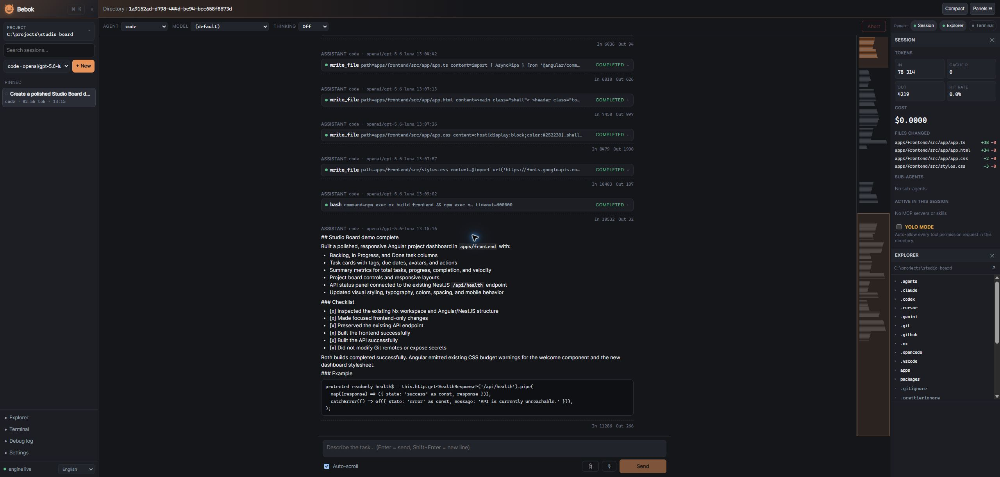
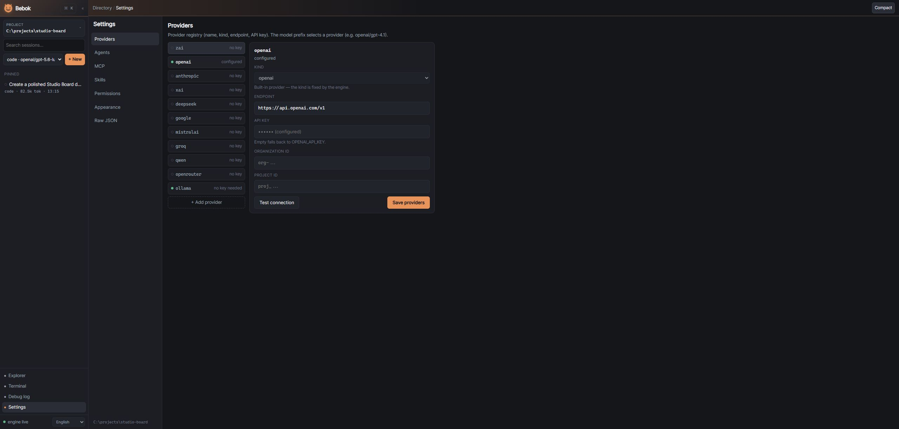
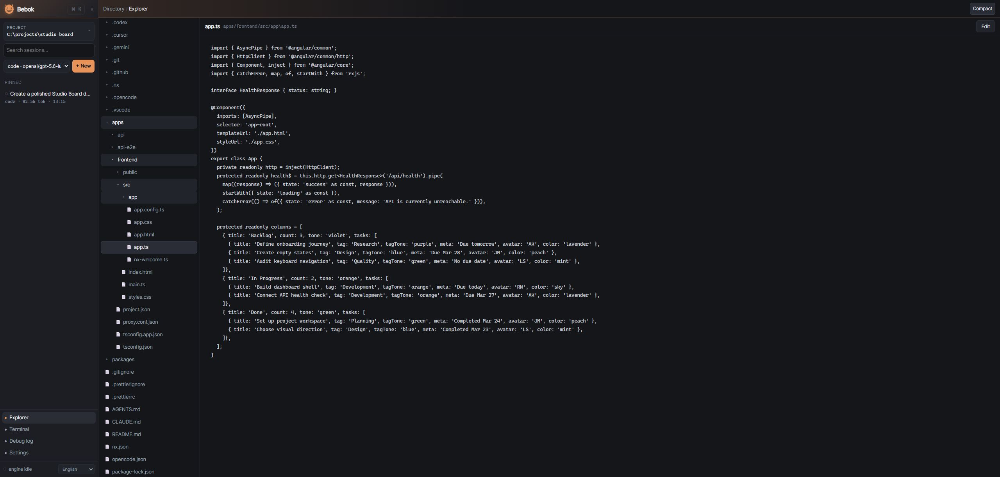

# Bebok 1.4.1

Bebok is a local-first AI coding agent built from scratch with a Rust engine and an Angular client. The engine owns sessions, tools, permissions and configuration, while the client provides the desktop and browser interface.

## Screenshots



English Studio Board chat with tool activity and panels.



Provider settings with a masked API key.



Project Explorer showing code from the current project.

## Features

- **Rust engine + SSE** - axum, tokio; all logic and state live in the engine (the GUI only renders).
- **Agent loop** - streaming + tool calls across **many providers** (OpenAI, Anthropic, Z.ai/GLM, xAI, DeepSeek, Google, Mistral, Groq, Qwen, OpenRouter, Ollama), selected by model prefix.
- **Permissions** - `globset` patterns (`tool(args)`), `allow`/`deny`/`ask` verdicts, decision cache, global + project rules.
- **Built-in tools** - `read_file` (with `offset`/`limit` line ranges), `write_file`, `append_file`, `edit_file`, `bash`, `fetch` (HTTP), plus native Rust ports of the common shell commands (`pwd`, `list_dir`, `tree`, `stat`, `du`, `head`, `tail`, `wc`, `sort`, `uniq`, `diff`, `which`, `glob`, `grep`, `mkdir`, `touch`, `cp`, `mv`, `rm`, `chmod`) so the agent never needs OS-specific scripts.
- **MCP** - `rmcp` bridge (stdio + streamable HTTP); MCP tools join the shared permission gate as `mcp__<server>__<tool>`.
- **Agents** - built-in presets (`code`, `ask`, `plan`, `debug`, `orchestrator`) + files in `~/.config/bebok/agent/*.md` and `<project>/.bebok/agent/*.md` with hot reload.
- **Skills & AGENTS.md** - global/project `AGENTS.md` + `skill/*/SKILL.md` appended to the system prompt (with toggles).
- **Explorer** - gitignore-aware lazy file tree + preview/edit served through the engine (`/fs/*`).
- **Debug log** - a single `debug.log` file next to the global config (cleared on startup, 10 000 chars cap) logging LLM + HTTP requests/responses, shown in the Debug tab.
- **Plugins** - in-process event-observer API: any `BebokPlugin` observes every bus event and can hook (mutate/veto) the agent loop at `before.request`, `before.tool`, `after.tool`, `turn.end`, `permission.resolved` (register code-side; introspect via `GET /plugins`).
- **Context management** - tool-output truncation, pruning, and compaction (internal fork; full history always available) + in-place rollback (`truncate`).
- **Sessions** - fork / `continueLast` / export / truncate / delete; sidebar (tokens, prompt-cache, cost, files changed).
- **Configuration** - JSONC (with comments), per-agent-type model overrides, provider registry, interpreter paths (python/python3/node/php/docker/git), Docker access check, yolo mode.
- **Thinking effort** - configurable reasoning level (`off`/`low`/`medium`/`high`/`max`), mapped per provider (`reasoning_effort` for OpenAI-compatible, `budget_tokens` for Anthropic/Z.ai).
- **Terminal** - engine-owned PTY (portable-pty, 1 MiB scrollback ring, resize, one-time 30 s tickets) + xterm.js tabs with reattach. Not available in Android builds (PTY surface is compiled out there).
- **i18n** - 12 languages, default English.

## Tech stack

- **Engine**: Rust, edition 2024 (axum, tokio, rmcp, globset, notify, ignore, reqwest, serde).
- **Client**: Angular 20.3 (standalone components, signals, zoneless).
- **Desktop**: Tauri 2 (shell spawning the engine as a sidecar).
(@TODO - **Mobile**: Capacitor (client → remote engine over LAN).)

## Structure
```text
./
├── engine/ # Rust workspace (virtual; default-members = bebok-server)
│ ├── crates/
│ │ ├── bebok-core/ # config/, session/, agent/, permission/, store/, event bus, plugin, context, debug
│ │ ├── bebok-server/ # binary: main.rs + server.rs + state.rs + cli.rs + cors.rs + error.rs
│ │ │ # + middleware.rs + routes/ (facade) + services/ (orchestration)
│ │ ├── bebok-tools/ # Tool trait + built-in tools + registry + runtimes + docker probe + explorer
│ │ ├── bebok-llm/ # Provider trait + OpenAI/Anthropic/Z.ai/OpenAI-compatible clients (SSE) + spec.rs
│ │ ├── bebok-mcp/ # MCP bridge (rmcp)
│ │ ├── bebok-skills/ # AGENTS.md + skills discovery + frontmatter + prompt assembly
│ │ └── bebok-pty/ # PTY manager: spawn, scrollback ring, resize, tickets, Job Object
│ └── Cargo.toml
├── client/ # Angular 20 (web) + Tauri 2 (desktop) + Capacitor (mobile)
│ ├── src/
│ │ ├── app/ # bootstrap, routes
│ │ ├── core/ # engine client, transport, events/activity/tabs/prefs/css stores, DTOs
│ │ ├── views/ # start/, chat/, explorer/, terminal/, settings/, connect/, config/, debug/
│ │ ├── ui/ # permission-popup/, session-sidebar/, html-preview/, shared UI
│ │ └── i18n/ # 12 translation dictionaries (en.ts is the reference)
│ ├── scripts/copy-sidecar.mjs # release binary -> src-tauri/binaries/bebok-server-[.exe]
│ ├── capacitor.config.ts # mobile shell (webDir -> dist/bebok/browser)
│ └── src-tauri/ # Tauri 2 shell (spawns engine sidecar, native dialogs)
├── AGENTS.md # contributor/agent orientation guide
└── LICENSE
```


## Requirements

- Rust ≥ 1.85 (edition 2024)
- Node.js ≥ 20 + npm
- (desktop) Tauri 2 system dependencies - see [tauri.app](https://tauri.app/start/prerequisites/)

The engine and client build on **Linux and Windows**. CI
([`.github/workflows/ci.yml`](.github/workflows/ci.yml)) builds and tests the
engine (`cargo build` / `cargo test --workspace` from `engine/`) plus the client
(`npm ci` + `npm run build` from `client/`) on both `ubuntu-latest` and
`windows-latest`.

## Running

### 1. Engine (headless)

```bash
cd engine
ZAI_API_KEY=<key> cargo run
```

The engine listens on `http://127.0.0.1:8787` by default (no password). Bind flags are `--host IP`, `--port PORT`, `--addr IP:PORT`, or the `BEBOK_ADDR` environment variable; explicit flags take precedence. Extra CORS origins can be provided through `BEBOK_CORS` (comma separated). Provider API keys resolve through the configured provider, its environment variable, then the top-level `api_key` fallback.

### 2. Client (browser mode)

```bash
cd client
npm install
npm start            # http://localhost:4200
```
Enter the engine address (http://127.0.0.1:8787) and pick a project directory.

### 3. Desktop (Tauri)

```bash
cd engine && cargo build --release
cd ../client && npm run sidecar:copy && npm run tauri:build
```

`sidecar:copy` copies the release engine binary to `src-tauri/binaries/bebok-server-[.exe]` using the target triple from `rustc -vV`. `tauri:build` compiles the frontend, bundles the sidecar and produces the platform binary and installers. For development, use `npm run tauri:dev`.

The engine prints `BEBOK_READY http://host:port` on stdout so the shell can discover a sidecar started with `--port 0`; logs go to stderr.

### 4. Mobile (Capacitor)

```bash
cd client && npm run build && npx cap sync
npx cap open ios     # or: npx cap open android
```

The mobile client connects to a remote engine over LAN (see the connect
screen). The PTY surface (/pty*) is compiled out of Android engine builds,
so the mobile client has no terminal.

## Projects

A project is a registered directory with a friendly name. Bebok stores the registry in
`~/.config/bebok/config.json` under the `projects` key. Desktop uses the native directory
dialog; browser and Capacitor clients use Bebok's in-app directory browser.

### Tests

```bash
cd engine && cargo test --workspace   # engine
cd ../client && npm run build         # client (build = type-check)
```

## Configuration

Configuration is JSONC (comments preserved), loaded in layers:
global ~/.config/bebok/config.json → project /.bebok/config.json
(overrides global; providers merge by name). Sections:

```jsonc
{
  "model": "zai/glm-5.3-flash",    // default model (prefix selects the provider)

  // per-agent-type model overrides (code / ask / plan / debug / orchestrator)
  "models": {
    "plan": "anthropic/claude-sonnet-4-5"
  },

  // provider registry: name, kind, endpoint, api_key (empty = env var), models
  "providers": [
    { "name": "openai", "kind": "openai", "endpoint": "https://api.openai.com/v1", "api_key": "" },
    { "name": "ollama", "kind": "openai", "endpoint": "http://localhost:11434/v1", "api_key": "" }
  ],

  "api_key": "...",                  // fallback provider key
  "max_tokens": 8192,
  "thinking": "off",               // reasoning effort: off | low | medium | high | max
  "context_budget": 64000,           // tokens before pruning/compaction
  "tool_output_cap": 32768,          // per-tool-output truncation (bytes)
  "yolo": false,                     // auto-allow every tool call (dangerous)

  "permission": { "rules": [
    { "pattern": "bash(git *)", "action": "allow" },
    { "pattern": "fetch(http://127.0.0.1:*)", "action": "allow" }
  ]},

  "mcp": {
    "filesystem": { "transport": "stdio", "command": "npx", "args": ["-y", "..."], "enabled": true },
    "github":     { "transport": "http", "url": "https://...", "headers": { "Authorization": "..." }, "enabled": false }
  },

  "skills": { "commit-helper": false },

  "runtimes": {
    "python": "/usr/bin/python3",
    "python3": "/usr/bin/python3",
    "node": "/usr/bin/node",
    "php": "/usr/bin/php",
    "docker": "/usr/bin/docker",
    "git": "/usr/bin/git"
  },

  "ui": { "customCss": "", "customCssFiles": [] }  // client-only theme text
}
```
Effective model per turn: prompt-body model → agent preset model →
session model → models. → model. An explicit agent on a prompt
persists to the session for subsequent turns.

Most of this (model, per-type models, providers + "check available models",
API key, permission rules, MCP, skills, interpreter paths, Docker check) is
editable in the GUI: Settings. GUI edits go through JSONC delta writers
(atomic tmp+rename, comments preserved) + instance reload.

## Tools

The built-ins are the portable primitives the agent should reach for instead of
writing OS-specific scripts (`bash` runs `cmd /C` on Windows, `sh -c` elsewhere):

- `read_file` - `path` plus optional `offset` (1-based line) / `limit` (lines);
  returns the raw file when no range is given, and a `[read_file: lines a-b of n]`
  marker when it slices (so no `head`/`sed`/node one-liners).
- `fetch` - HTTP request/response as a tool: `url`, `method` (default `GET`),
  `headers`, `json` (or raw `body`), `max_bytes` (default 64 KiB, max 1 MiB).
  Streams the body, pretty-prints JSON, honours the turn's abort token.
  Same behaviour on every OS, so no `curl`/`jq`/node probe scripts.
- Per-call permission class: `GET`/`HEAD` count as read-only (default `allow`),
  every other method defaults to `ask`. Rules match on the URL
  (`fetch(http://127.0.0.1:*)`) because `url` is the canonical arg text.
- `bash` - `command` only, run through the platform shell. Reach for it only
  when no native tool fits (builds, tests, git, package managers).
- File management - native ports of the common shell commands, identical on
  every OS: `mkdir`, `touch`, `cp`, `mv`, `rm` (a directory needs
  `recursive: true`), `chmod`, `ln` (symbolic or hard), `gzip`
  (compress/decompress), and `append_file` (grows a file without re-sending its
  whole content).
- Inspection - `list_dir`, `tree`, `stat` (type/size/mtime/mode), `du` (size
  breakdown), `head`, `tail`, `wc`, `sort`, `uniq`, `diff` (unified, Myers),
  `which` (is it installed?), `glob`, `grep`, `find` (glob/type/depth,
  gitignore-aware), `realpath`, `basename`, `dirname`, `sha256sum`, `base64`
  (read-only unless `out` is given).
- Text - `read_file` (ranges), `edit_file` (literal replace), `sed`
  (`s/pattern/replacement/flags`, regex, in place by default).
- Read-only tools default to `allow`, mutating ones to `ask` (see Permissions).

## Endpoints (engine)

Directory-keyed endpoints take ?directory=. The single route table lives in
engine/crates/bebok-server/src/routes/mod.rs.

| Method | Path | Description |
|--------|------|-------------|
| POST | /session | create ({ directory, agent?, model?, continueLast?, forkOf? }) |
| GET | /session?directory= | list sessions |
| GET | /session/{id} | session meta (+ usage totals) |
| DELETE | /session/{id} | delete session (409 while a turn runs) |
| GET | /session/{id}/message | messages (full parts transcript) |
| POST | /session/{id}/prompt | start a turn (202; 409 when busy) |
| POST | /session/{id}/abort | abort a turn |
| GET | /session/{id}/export | full JSON export (meta + transcript) |
| POST | /session/{id}/compact | compact as an internal fork (new session, parent set) |
| POST | /session/{id}/truncate | rollback in place ({ keep }) |
| POST | /session/{id}/permission/{requestID} | permission decision (allow/deny + always) |
| GET | /agent?directory= | agents (presets + files) |
| GET | /mcp?directory= | MCP servers + status |
| POST | /mcp/{name}/toggle?directory= | enable/disable an MCP server |
| GET/PUT | /config?directory= | resolved config (PUT = delta write + reload) |
| GET | /docker?directory= | Docker access probe |
| GET | /models?directory=&provider= | list a providers models (persists into project config) |
| GET | /fs/tree?directory=&path= | gitignore-aware lazy file tree (immediate children) |
| GET/PUT | /fs/file?directory=&path= | file content (viewer / edit) |
| GET | /plugins | registered plugins + exposed hook points |
| GET | /event | SSE stream ({ type, directory, sessionID, properties }) |
| GET/DELETE | /debug/log | debug log (LLM + HTTP requests/responses) |
| POST/GET | /pty | create / list terminal sessions (non-Android only) |
| POST | /pty/{id}/ticket | one-time connect ticket (30 s TTL, single-use) |
| GET | /pty/{id}/connect?ticket= | WebSocket upgrade (terminal) |

Status semantics: 202 = prompt accepted (turn runs in background),
409 = session busy, 404 = unknown session/ask/rule, 400 = bad request.

## [windows] — finding the desktop sidecar engine + delegation test (2026-09-11)

bebok-desktop.exe spawns bebok-server.exe with `--port 0`, so the engine port is random.
Find it with `tasklist | findstr /I bebok` (get the bebok-server.exe PID) then
`netstat -ano | findstr LISTENING` (match that PID to a 127.0.0.1:PORT line — e.g. PID 5980
-> 127.0.0.1:64083 on 2026-09-11). Port 8787 applies only to `cd engine && cargo run`.
Verify with GET /plugins and GET /agent?directory= (both 200 on the sidecar).

Delegation smoke test: create an orchestrator session (POST /session), prompt it
(POST /session/{id}/prompt -> 202), poll GET /session/{id}/message, then list sessions
(GET /session?directory=) filtering by parent==parentID to find the ASK child.
Note: the orchestrator may answer directly without calling the `task` tool unless told
"You MUST use the `task` tool now ... Do NOT answer directly". Cancelling a child aborts
the whole parent turn. Unit-level proof without a running engine:
`cd engine && cargo test -p bebok-core task_` (5 passed).

Cmd gotchas: no head/tail/wc/grep/curl — use findstr/tasklist/netstat; avoid
`node -e` quoting traps by writing probe .js files and running `node file.js`.
